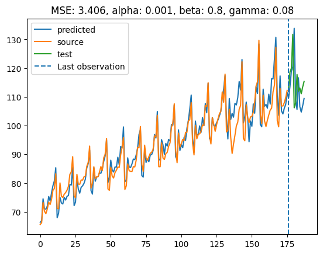

# Цель работы

Воспроизвести модель Хольта-Уинтерса 

# Постановка задачи

1. Реализовать модель Хольта-Уинтерса на Python.
2. Обеспечить возможность подачи временного ряда, параметров сглаживания, длины периода сезона и горизонта прогнозирования в качестве входных данных.
3. Реализовать режим тюнинга гиперпараметров с использованием алгоритмов машинного обучения для:
    - Подбора параметров сглаживания.
    - Опционального выбора длины сезона.
4. На выходе:
    - Выводить параметры модели (коэффициенты тренда и сезонности).
    - Генерировать прогнозные значения для заданного горизонта.
    - В режиме тюнинга дополнительно предоставлять оптимальные значения гиперпараметров.

# Описание модели

Мне понравилось объяснение на этом [сайте](https://www.itl.nist.gov/div898/handbook/pmc/section4/pmc435.htm)

alpha, beta, gamma - гиперпараметры, которые мы будем подбирать. Все они принадлежат промежутку от 0 до 1.

L - количество периодов в одном сезоне. m - количество периодов для предсказания

Залогом успеха модели является правильная инициализация параметров модели. Я использовал следующий подход:

1. Для опорной компоненты бралось среднее за первый период сезонности
2. Для тренда бралось отношение среднего за второй период сезонности и первого периода сезонности без единицы
3. Для сезонной компоненты я брал отношение текущего значения временного ряда и среднего для первого периода сезонности

# Результаты

[Ноутбук](Модель Хольта-Уинтерса.ipynb)

Реализовано два подхода к обучению.

Первый: гиперпараметры задаем сами 

Второй: автоподбор с помощью optuna

