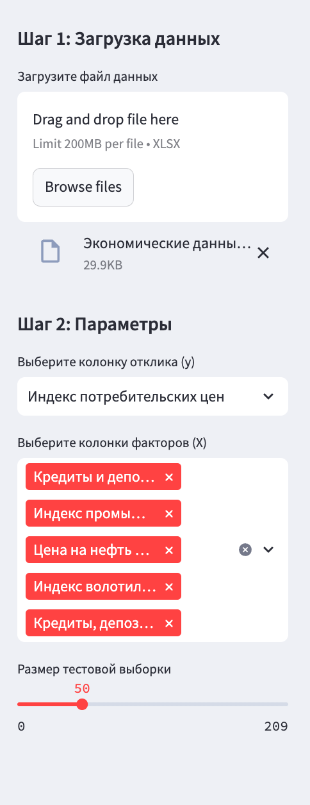
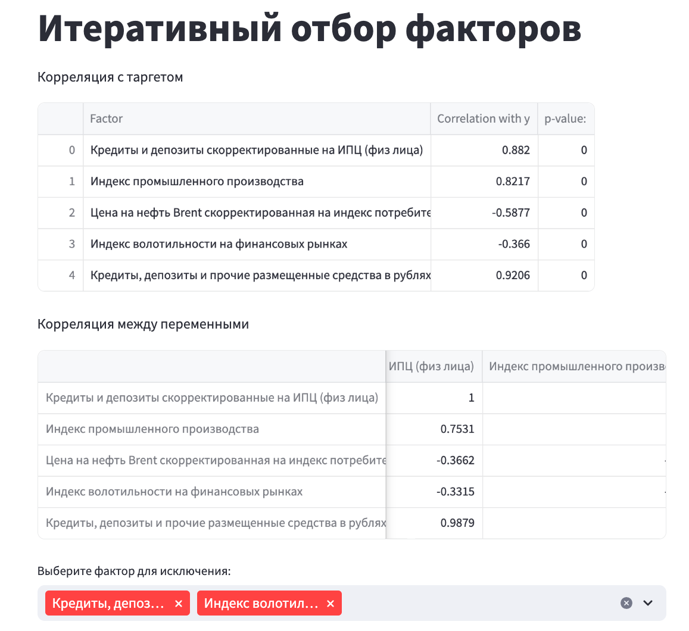
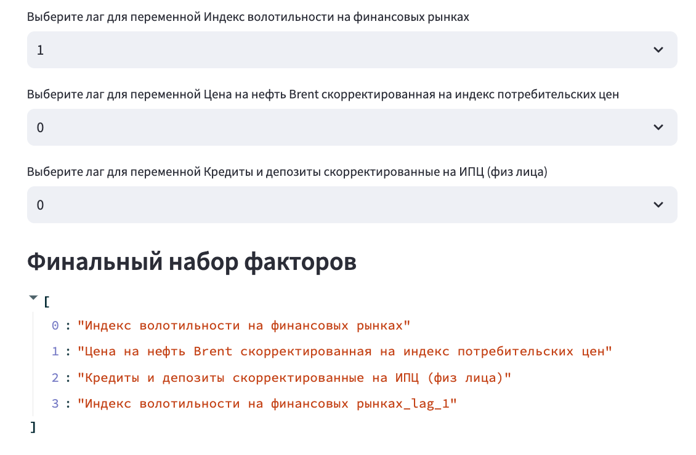
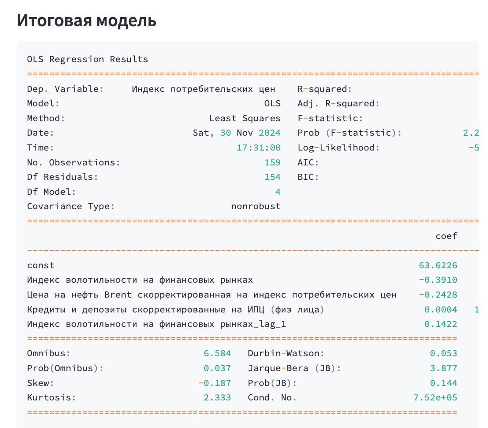
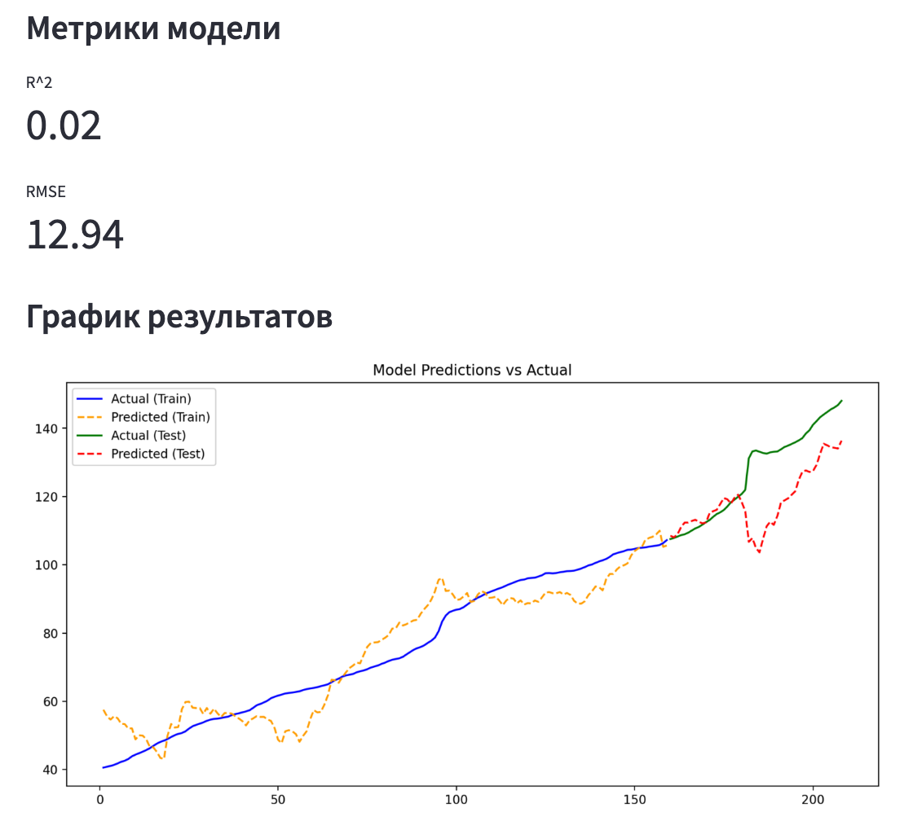
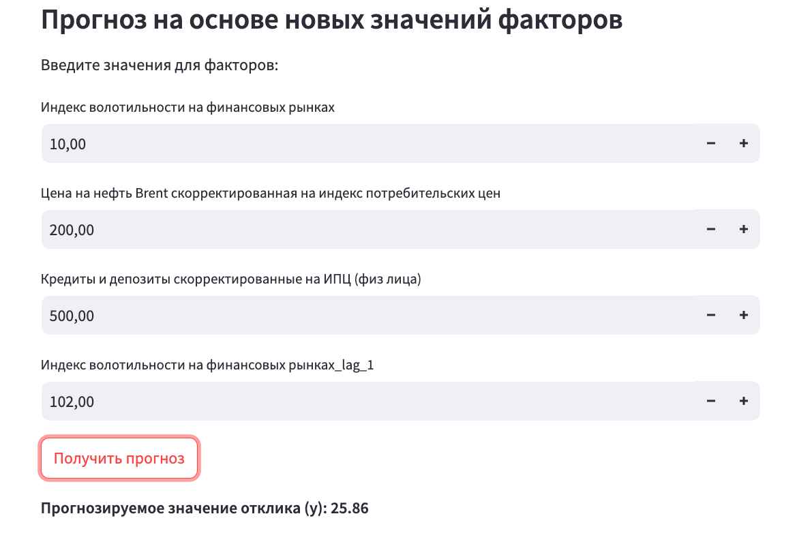

# Цель работы

Реализовать интерактивный интерфейс для работы с множественной регрессией

# Постанока

1. Реализовать web интрефейс с помощью streamlit
2. Обеспечить возможность подачи данных в систему
3. Реализовать возможность выбирать признаки для модели с учетом корреляции
4. Визуализировать результаты
5. Добавить возможность выбирать лаги переменных

# Демонстрация работы программы

Запуск программы происходит при помощи

streamlit run test_streamlit.py

Сначала выбираем данные и размер тестовой выборки

Есть возможность оценить связи между переменными и выбрать переменные для исключения

Можно выбрать лаги переменных и получить итоговый список переменных

Вывод модели, где можно посмотреть все основные статистики и оценить важность переменных

Затем можно оценить качество модели на тестовой выборке

Затем можно ввести значения для каждой переменной и получить предсказание модели

